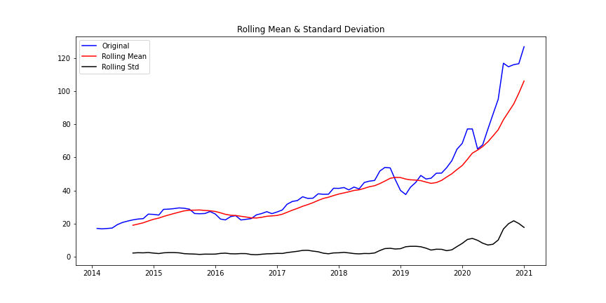

# Time Series Analyses of Apple Stock

Ripton Rosen

# Description

The aim of this project is to create a time series analysis using SARIMA models and Facebook Prophet to predict the stock price of Apple. 

# Data

My data was acquired from [Yahoo! Finance](https://www.finance.yahoo.com/), where you can set specific dates and download a CSV file of the prices from the days in between.  My data is from January 1st, 2014 to December 31st,  2020.  I decided to include the stock data during the initial part of the COVID-19 Pandemic because I wanted to use more up-to-date data, despite the extreme volatility during that time.  Stock prices for many technology companies plummeted in March and then went on an unprecedented run from then on out. 

# Data Cleaning

Scrubbing of data was relatively easy, given that everything came in a neat CSV file from Yahoo Finance.  Since it’s a time series analysis, the index needed to be the date and set to datetime. I had to decide which stock price I’d use between:
* Open 
* Close
* Adjusted Close  

I went with ‘Adjusted Close’ because it seemed to be the best estimate of the closing price of Apple’s stock price at the end of a given day.  

# Data Exploration

In my preliminary data exploration, I wanted to investigate the trends in Apple’s stock and my assumption that the stock price increases the most towards the end of the year, when they come out with their new line of products and it’s holiday time.  I created a bar plot that plotted monthly stock price over the years from 2014-2020.

Most glaring in this plot is the heavy increase in stock price in 2020, during the COVID-19 pandemic.  I next wanted to investigate, using boxplots, just how much of an anomaly 2020 was in this group.  

We can pretty clearly see that 2020 as a whole, can nearly be considered an outlier.  The amount of stock variance and the stock price high are unprecedented.  This shows that modeling a time series of stock prices will be more difficult than it normally would be.  My curiosity got the best of me and I decided to keep in 2020, instead of disregarding it and seeing how close I could get my modeling. 

Time series analysis with stock prices are non-stationary, but I wanted to run a stationarity check anyways, just to make sure. We also have the blue line as the original time series of the stock price. 

As we can see by the high p-value of .999071, it is non-stationary.  

As a next step, I wanted to check the ACF (auto-correlation function) and PACF (partial auto-correlation function) of the time series.  ACF describes how much the current value is related to the past values of a series.  The PACF looks for correlations in a time series with the intervening observations removed. 

We see that there is little correlation in both the ACF and PACF plots after order 1.

The third check I wanted to do was a decomposition of the time series to check for trends and seasonality.  An assumption I made at the beginning of the project was that Apple stock price is seasonal, given their release of a new slate of products at the end of the year around a time that customers shell out money for the holidays.

We see from the decomposition that there is indeed a seasonality and an upward trend in the stock price, with a gradual and then steep incline around 2020.

# Models

I went with SARIMA and Facebook Prophet as the two models I wanted to use for the time series predictions.  I ran into a few issues with my SARIMA models before fixing them.  The SARIMA forecasts wouldn’t actually ‘forecast’.  They looked like energy blasts in cartoons (the Kamehameha comes to mind).  

The confidence interval is the shaded grey area, while the orange line was supposed to be the prediction.  I ended up doing four different SARIMA models with different codes to try and forecast the predictions in this way, but they wouldn’t cooperate.  I ended up fixing the models, but dropping the confidence intervals and having two separate SARIMA models, one with 2020 included and one without.  

* **2020 Excluded**

* **2020 Included**

The SARIMA forecast performed pretty well and the test data had an RMSE (root-mean-square error) of 6.59.  The SARIMA with 2020 included gave a much higher RMSE of 25.95.

The Facebook Prophet model performed about the same as the SARIMA model with 2020 included.  With an RMSE of 24.54 on the non-tuned model and 31.50 on the tuned model.

* **Basic Model**

* **Tuned Model**

We can see that the stock prices skyrocket while the model predicts them to stick to a more predictable, upward trend.  The COVID-19 pandemic blew up the model.

# Interpretation

The models work and predict stock price pretty well over time when we don’t include the 2020 pandemic-stricken year.  With good RMSE from the SARIMA model when it predicts from January 2018 to January 2020.  The Facebook Prophet model shows what happens when 2020 is included.  The biggest issue is that not enough time has elapsed since the technology stock price explosion that the pandemic brought, so the model can’t take it into account when we do a train-test data split.

# Conclusion and Further Work

While the SARIMA model could predict stock prices pretty well up until right before the pandemic, the Facebook Prophet model couldn’t account for the unprecedented stock price rise.  Further work would include, simply, waiting for some more time to elapse so that the volatility can be taken into account in the models.  I would also like to try and implement an LSTM model to try and more accurately predict the time series of Apple stock, and also try using different parameters for the SARIMA and Facebook Prophet models. 
